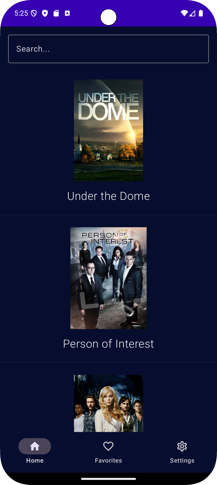
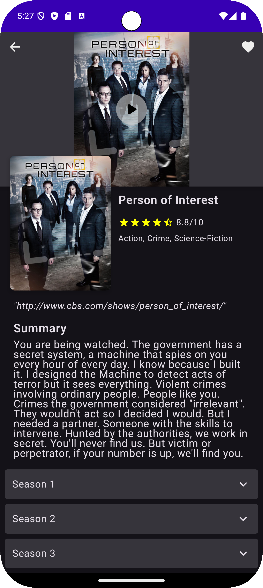

# 🎬 NewMovShow

**A modern Android TV series and movie discovery app built with Jetpack Compose**

NewMovShow is a sleek and intuitive Android application that allows users to explore, search, and manage their favorite TV shows and movies. Built with the latest Android technologies and following Clean Architecture principles.

## ✨ Features

### 🔍 **Discovery & Search**
- Browse popular TV shows and movies
- Advanced search functionality with real-time results
- Detailed information including ratings, genres, and summaries

### ⭐ **Favorites Management**
- Mark shows and movies as favorites
- Dedicated favorites screen for quick access
- Persistent storage for your preferences

### 📺 **Detailed Information**
- Comprehensive show details with high-quality posters
- Season and episode breakdown
- Episode summaries and air dates
- Next episode countdown
- Rating system with visual stars

### 🎨 **Modern UI/UX**
- Built entirely with Jetpack Compose
- Dark theme optimized for viewing
- Smooth animations and transitions
- Pull-to-refresh functionality
- Responsive design

## 🛠️ Tech Stack

### **Architecture**
- **MVVM** (Model-View-ViewModel) with Clean Architecture
- **Repository Pattern** for data management
- **Use Cases** for business logic separation

### **UI Framework**
- **Jetpack Compose** - Modern Android UI toolkit
- **Navigation Compose** - Type-safe navigation
- **Material Design 3** - Latest design system

### **Dependency Injection**
- **Dagger Hilt** - Dependency injection framework

### **Networking**
- **Retrofit** - REST API client
- **OkHttp** - HTTP client with logging interceptor
- **Gson** - JSON serialization

### **Database**
- **Room** - Local database with SQLite
- **Type Converters** - Complex data storage

### **Image Loading**
- **Coil** - Fast image loading for Compose

### **Async Programming**
- **Kotlin Coroutines** - Asynchronous programming
- **Flow** - Reactive data streams

### **Testing**
- **JUnit 5** - Unit testing framework
- **MockK** - Mocking library for Kotlin
- **Turbine** - Flow testing utilities
- **Coroutines Test** - Testing coroutines

### **Additional Libraries**
- **Timber** - Logging
- **Joda Time** - Date and time handling

## 🏗️ Architecture Overview

```
┌─────────────────┐
│   Presentation  │ ← Jetpack Compose UI
│    (UI Layer)   │
└─────────────────┘
         │
┌─────────────────┐
│     Domain      │ ← Business Logic
│  (Use Cases)    │
└─────────────────┘
         │
┌─────────────────┐
│      Data       │ ← Data source
│ (Local/Remote)  │
└─────────────────┘
```

### **Key Components**
- **ViewModels**: Manage UI state and business logic
- **Use Cases**: Encapsulate specific business operations
- **Data Sources**: Local (Room) and Remote (TVMaze API)

## 📱 Screenshots

The app features three main sections:
<div style="display: flex; justify-content: space-between; width: 100%;">
  
  
</div>

## 🚀 Getting Started

### **Prerequisites**
- Android Studio Hedgehog | 2023.1.1 or newer
- JDK 17 or higher
- Android SDK API 24+ (Android 7.0)

### **Installation**

1. **Clone the repository**
   ```bash
   git clone https://github.com/dahlaran/NewMovShow.git
   cd NewMovShow
   ```

2. **Open in Android Studio**
   - Launch Android Studio
   - Select "Open an existing project"
   - Navigate to the cloned directory

3. **Build the project**
   ```bash
   ./gradlew build
   ```

4. **Run the app**
   - Connect an Android device or start an emulator
   - Click the "Run" button in Android Studio

## 🔧 Configuration

The app uses the **TVMaze API** for fetching show data. No API key is required as it's a free service.

### **Build Variants**
- **Debug**: Development build with logging enabled
- **Release**: Production build with optimizations

## 🧪 Testing

Run the test suite:

```bash
# Unit tests
./gradlew test

# Instrumented tests
./gradlew connectedAndroidTest
```

### **Test Coverage**
- Unit tests for ViewModels, Use Cases
- Mocking with MockK for reliable test isolation
- Flow testing with Turbine

## 📦 Build

### **Debug Build**
```bash
./gradlew assembleDebug
```

### **Release Build**
```bash
./gradlew assembleRelease
```

## 🤝 Contributing

1. Fork the repository
2. Create your feature branch (`git checkout -b feature/AmazingFeature`)
3. Commit your changes (`git commit -m 'Add some AmazingFeature'`)
4. Push to the branch (`git push origin feature/AmazingFeature`)
5. Open a Pull Request

### **Development Guidelines**
- Follow Clean Architecture principles
- Write unit tests for new features
- Use meaningful commit messages
- Ensure code formatting with ktlint

## 📋 TODO / Roadmap

- [ ] Trailer player integration
- [ ] 60% test coverage
- [ ] Watchlist functionality
- [ ] Social features (reviews, ratings)
- [ ] Widget support
- [ ] Tablet optimization

## 🔗 API Reference

This app uses the [TVMaze API](https://www.tvmaze.com/api) for fetching TV show and movie data.

## 📄 Changelog

### **Version 1.0.0**
- Initial release
- Basic show browsing and search
- Favorites functionality
- Detailed show information

---

**Built with ❤️ using Kotlin and Jetpack Compose**